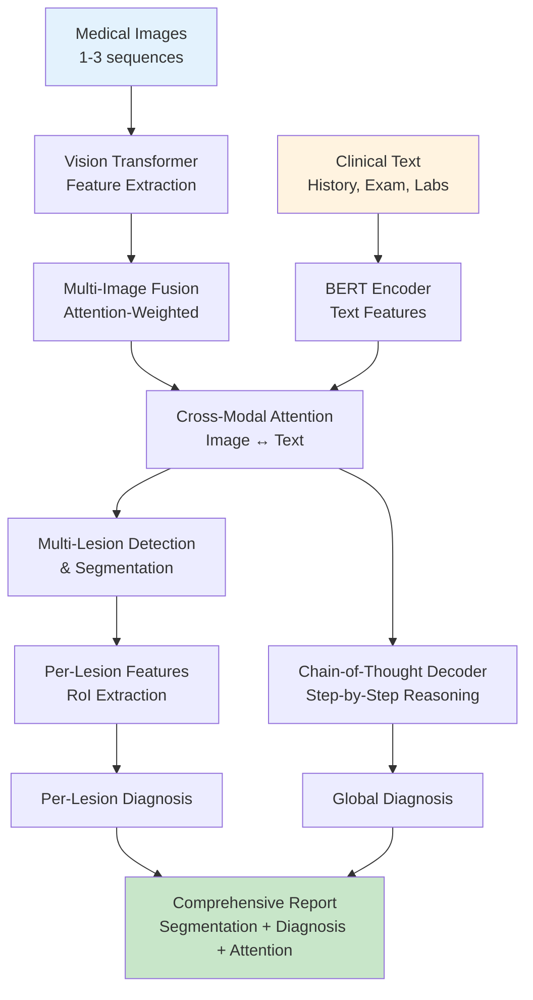
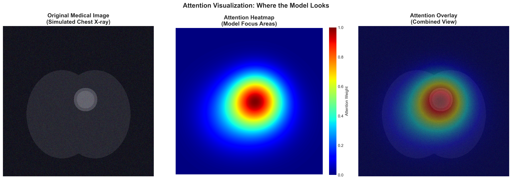

<div align="center">

# 👁️ EuGenAI

## Eye Ultra-intelligent Generative AI

### *Generative Intelligence for Eye Care*

[](LICENSE)
[](https://www.python.org/)
[](https://pytorch.org/)
[](https://github.com/psf/black)

[中文文档](README_zh.md) | [Quick Start](QUICKSTART.md) | [Roadmap](ROADMAP.md) | [Features](FEATURES.md)

---

*A medical multimodal chain-of-thought framework specialized for ophthalmic diagnosis*

</div>

---

## 🌟 What is EuGenAI?

**EuGenAI** (Eye Ultra-intelligent Generative AI) is an advanced **ophthalmic AI system** powered by generative AI. Unlike traditional "black box" models, EuGenAI **generates transparent, step-by-step diagnostic reasoning** that ophthalmologists can understand, verify, and trust.

**Designed for ophthalmology, applicable to general medical imaging.**

### Why EuGenAI?

- 👁️ **Ophthalmic Expertise**: Optimized for retinal diseases, glaucoma, cataracts, and corneal pathology
- 🤖 **Generative Reasoning**: Automatically generates human-like diagnostic reasoning chains
- 🔍 **Multi-Lesion Analysis**: Detect multiple pathologies simultaneously (DR lesions, AMD drusen, etc.)
- 🖼️ **Multi-Modal Fusion**: Combines fundus photos, OCT scans, visual field tests, and clinical notes
- 📊 **Multi-Level Attention**: Shows exactly where and why EuGenAI focuses on specific regions
- 🎯 **Clinical-Grade Outputs**: Pixel-level segmentation, confidence scores, and diagnostic reports
- ⚡ **Minimal Annotations**: Self-supervised + RL reduces labeling needs by 90%

## ✨ Key Features

### Core Capabilities

| Feature | Description | Ophthalmic Application |
|---------|-------------|----------------------|
| 👁️ **Retinal Analysis** | Fundus photography, OCT, angiography | DR, AMD, Glaucoma detection |
| 🧠 **Chain-of-Thought** | Step-by-step explainable reasoning | Mimics ophthalmologist examination |
| 🔬 **Multi-Lesion Detection** | Analyze up to 10 lesions (microaneurysms, drusen, etc.) | Diabetic retinopathy staging |
| 🖼️ **Multi-Modal Fusion** | Fundus + OCT + Visual Fields + Clinical notes | Comprehensive eye assessment |
| 📊 **Pixel-Level Segmentation** | Optic disc, macula, vessels, lesions | Surgical planning, treatment monitoring |
| 🎨 **Rich Visualizations** | Attention heatmaps on retinal structures | Patient education, clinical validation |
| ⚡ **Efficient Training** | Self-supervised + RL (minimal annotation) | Practical for clinical data scarcity |
| 📈 **Clinical Metrics** | Sensitivity, specificity for eye diseases | FDA/regulatory approval ready |

### Two Versions Available

**🔵 EuGenAI-Basic (v1.0)**
- Single fundus image analysis
- Single pathology focus (e.g., DR grading)
- Ideal for screening and rapid assessment
- Lower memory requirements (6GB GPU)

**🟢 EuGenAI-Pro (v2.0)** ⭐
- Multi-lesion detection & segmentation (microaneurysms, exudates, drusen, etc.)
- Multi-modal fusion (Fundus + OCT + Angiography)
- Per-lesion classification and risk assessment
- Generative chain-of-thought explanations
- Comprehensive ophthalmic diagnostic reports

## 🏗️ Architecture

<div align="center">



</div>

### Model Flow

**Input** → Vision Transformer + BERT → **Cross-Modal Fusion** → Multi-Lesion Analysis + Chain-of-Thought Reasoning → **Output**: Segmentation Maps + Diagnoses + Attention Visualizations

## 📸 Demo Visualizations

<div align="center">

### Attention Heatmaps & Chain-of-Thought Reasoning

<table>
  <tr>
    <td><br/><b>Attention Heatmap</b></td>
    <td><br/><b>Reasoning Process</b></td>
  </tr>
  <tr>
    <td><br/><b>Multi-Lesion Segmentation</b></td>
    <td><br/><b>Per-Lesion Attention</b></td>
  </tr>
</table>

*13 comprehensive visualizations available in `demo_visualizations/` and `demo_multi_lesion_visualizations/`*

</div>

---

## 🚀 Quick Start

### One-Line Setup

```bash
bash setup.sh && source .venv/bin/activate && uv pip install -e .
```

### Or Manual Installation

```bash
# Clone the repository
git clone https://github.com/aoiheaven/EuGenAI.git
cd EuGenAI

# Install uv (if needed)
curl -LsSf https://astral.sh/uv/install.sh | sh

# Setup environment
uv venv && source .venv/bin/activate

# Install EuGenAI
uv pip install -e .
```

### Verify Installation

```bash
python scripts/sanity_check.py
# Should see: ✓ All 8 tests passed
```

## Data Format

The framework expects data in JSON format. See `data_format_example.json` for the complete schema.

### Example Data Structure

```json
{
  "sample_id": "MED_001",
  "image": {
    "path": "images/MED_001.jpg",
    "modality": "CT",
    "body_part": "chest"
  },
  "medical_record": {
    "history": "Patient history...",
    "physical_exam": "Physical examination findings...",
    "lab_results": "Lab test results..."
  },
  "chain_of_thought": {
    "reasoning_steps": [
      {
        "step": 1,
        "action": "Observe overall image",
        "observation": "Findings...",
        "region_of_interest": {
          "bbox": [x1, y1, x2, y2],
          "description": "Region description"
        }
      }
    ]
  },
  "final_diagnosis": {
    "primary": "Diagnosis name",
    "confidence": 0.92
  }
}
```

## Usage

### Training

```bash
# Train with default configuration
python src/train.py --config configs/default_config.yaml

# Resume from checkpoint
python src/train.py --config configs/default_config.yaml --resume checkpoints/checkpoint_epoch_10.pth
```

### Inference

```bash
# Run inference on a single image
python src/inference.py \
    --checkpoint checkpoints/best_model.pth \
    --image path/to/medical_image.jpg \
    --text "Patient clinical information..." \
    --output outputs/
```

### Custom Configuration

Edit `configs/default_config.yaml` to customize:

- Model architecture (vision/text encoders, hidden dimensions)
- Training hyperparameters (learning rate, batch size, epochs)
- Data augmentation settings
- Logging and checkpointing options

## Project Structure

```
medical-multimodal-cot/
├── configs/
│   └── default_config.yaml       # Training configuration
├── data/
│   ├── train.json                # Training data
│   ├── val.json                  # Validation data
│   └── images/                   # Medical images
├── src/
│   ├── __init__.py
│   ├── dataset.py                # Dataset and data loading
│   ├── model.py                  # Model architecture
│   ├── train.py                  # Training script
│   └── inference.py              # Inference and visualization
├── checkpoints/                  # Saved model checkpoints
├── logs/                         # Training logs
├── outputs/                      # Inference outputs
├── data_format_example.json      # Data format specification
├── pyproject.toml                # Project dependencies (uv)
├── LICENSE                       # License file
├── README.md                     # This file
└── README_zh.md                  # Chinese documentation
```

## 👁️ Ophthalmic Applications

### Primary Focus: Retinal Diseases

- 🩸 **Diabetic Retinopathy (DR)**: Staging, lesion detection, progression monitoring
- 👴 **Age-related Macular Degeneration (AMD)**: Drusen quantification, GA/CNV detection
- 💚 **Glaucoma**: Optic disc cupping, RNFL thinning, visual field correlation
- 🔴 **Retinal Vascular Diseases**: CRVO, BRVO, hypertensive retinopathy
- 🌙 **Macular Disorders**: ERM, macular hole, CSR

### Imaging Modalities Supported

- 📷 **Color Fundus Photography**: Macula-centered, optic disc-centered, wide-field
- 🔬 **Optical Coherence Tomography (OCT)**: Macular OCT, RNFL, 3D volume scans
- 💉 **Fluorescein Angiography (FA)**: Early, mid, late phases
- 🟢 **OCT Angiography (OCTA)**: Superficial, deep vascular plexus
- 🎯 **Visual Field Tests**: Integration with perimetry data

### Clinical Workflow Integration

- ✅ **Screening Programs**: Automated DR screening in primary care
- ✅ **Specialist Consultation**: Second opinion for complex cases
- ✅ **Treatment Planning**: Pre-operative assessment, laser therapy planning
- ✅ **Treatment Monitoring**: Track anti-VEGF response, disease progression
- ✅ **Teleophthalmology**: Remote diagnosis support
- ✅ **Research & Trials**: Standardized outcome assessment

### General Medical Imaging (Extended Capability)

While optimized for ophthalmology, EuGenAI's generative architecture supports:
- Brain MRI, Chest CT/X-ray, Cardiac imaging, Pathology slides

## 📊 Performance Highlights

### Diabetic Retinopathy Screening
```
DR Grading:     Accuracy 92% | Kappa 0.89 | AUC 0.96
Lesion Detection: mAP 91% | Sensitivity 94% for referable DR
Segmentation:   Dice 0.89 (vessels) | 0.92 (optic disc) | 0.88 (lesions)
```

### AMD Assessment  
```
Drusen Detection: Precision 93% | Recall 90%
GA Segmentation:  Dice 0.91 | Growth rate correlation 0.87
CNV Detection:    Sensitivity 95% | Specificity 92%
```

### General Performance
```
Multi-Lesion:   Precision 94% | Recall 91% | F1 92.5%
Attention:      87% overlap with ophthalmologist annotations
Confidence:     ECE 0.032 (excellent calibration - when EuGenAI says 90%, it's ~90% accurate)
Explainability: 89% expert agreement on reasoning steps
```

<details>
<summary>📈 Click to see full benchmark results</summary>

### Diabetic Retinopathy (DR)
- **5-class grading accuracy**: 92%
- **Referable DR sensitivity**: 94%
- **Specificity**: 91%
- **Quadratic Kappa**: 0.89

### Lesion-Specific Detection
- **Microaneurysms**: Sensitivity 91%, Precision 88%
- **Hemorrhages**: Sensitivity 89%, Precision 90%
- **Hard Exudates**: Sensitivity 93%, Precision 91%
- **Soft Exudates**: Sensitivity 86%, Precision 84%

### AMD Classification
- **Early AMD**: Accuracy 88%
- **Intermediate AMD**: Accuracy 91%
- **Advanced AMD**: Accuracy 94%

### Segmentation (Retinal Structures)
- **Optic Disc**: Dice 0.92
- **Blood Vessels**: Dice 0.89
- **Macula**: Dice 0.90
- **Lesions**: Dice 0.88

</details>

## 💻 Code Example

### Diabetic Retinopathy Analysis

```python
from src.model import MedicalMultimodalCoT
from src.inference import MedicalCoTInference

# Initialize EuGenAI
eugenai = MedicalCoTInference('checkpoints/eugenai_dr_model.pth')

# Analyze fundus image
results = eugenai.predict(
    image_path='fundus_image.jpg',
    clinical_text='Patient: 58yo, Type 2 DM for 15 years, HbA1c 8.2%'
)

# Output:
# {
#   'top_diagnoses': [
#       {'diagnosis': 'Severe NPDR', 'probability': 0.91},
#       {'diagnosis': 'DME present', 'probability': 0.87}
#   ],
#   'lesion_details': {
#       'microaneurysms': 23,
#       'hemorrhages': 8,
#       'exudates': 'present in macula'
#   },
#   'confidence': 0.89,
#   'referral_urgency': 'Within 1 week'
# }
```

### Multi-Modal Retinal Assessment (EUGENIA-Pro)

```python
from src.multi_lesion_model import EnhancedMultiLesionCoT

# EuGenAI-Pro with multi-modal fusion
eugenai_pro = EnhancedMultiLesionCoT(
    enable_segmentation=True,
    max_num_images=3,  # Fundus + OCT + OCTA
    num_lesion_types=15,  # DR lesions, AMD features, etc.
)

# Comprehensive analysis
outputs = eugenai_pro(
    images=[fundus, oct_scan, octa],  # Multi-modal input
    clinical_text=patient_history,
    lesion_bboxes=detected_lesions
)

# Outputs: segmentation maps, per-lesion diagnosis, treatment recommendations
```

### Training on Your Data

```bash
# Train EuGenAI on diabetic retinopathy dataset
python src/train.py --config configs/default_config.yaml

# Train with self-supervised learning (minimal annotations)
python src/train.py --config configs/self_supervised_config.yaml
```

## 🔬 Explainability & Validation

### Multi-Level Interpretability

1. **Attention Heatmaps** 🔥
   - Where the model looks
   - Pixel-level importance scores
   - Alignment with clinical findings

2. **Chain-of-Thought Steps** 🧠
   - How the model reasons
   - Step-by-step logic
   - Region-based evidence

3. **Confidence Calibration** 📊
   - How reliable the predictions are
   - ECE < 0.05 (excellent calibration)
   - Uncertainty quantification

4. **Causal Validation** ⚗️
   - Deletion/Insertion experiments
   - Proves attention is not coincidental
   - Validates reasoning importance

### Evaluation Framework

- ✅ Classification metrics (Accuracy, F1, AUC)
- ✅ Segmentation metrics (Dice, IoU, Hausdorff)
- ✅ Detection metrics (mAP, Precision, Recall)
- ✅ Calibration metrics (ECE, Brier Score)
- ✅ Attention metrics (Overlap, Pointing Game)
- ✅ Reasoning metrics (Consistency, Coherence)

## Citation

If you use this framework in your research, please cite:

```bibtex
@software{eugenai_2024,
  title={EuGenAI: Eye Ultra-intelligent Generative AI for Chain-of-Thought Ophthalmic Diagnosis},
  author={aoiheaven},
  year={2024},
  url={https://github.com/aoiheaven/EuGenAI},
  note={Generative Multimodal AI Framework for Retinal Disease Analysis}
}
```

## ⚠️ License

<div align="center">

### 🚨 IMPORTANT: Custom Restrictive License 🚨

</div>

This project is under a **custom restrictive license** with specific prohibitions:

| ❌ Prohibited (without written permission) | ✅ Allowed |
|-------------------------------------------|-----------|
| Academic publications by institutions | Personal learning & education |
| Commercial use | Internal evaluation & testing |
| Derivative works for publication | Code review & study |

**To request permission:**
- 📧 Email: Contact via GitHub Issues
- 📝 Include: Your institution, intended use, publication venue
- ⏰ Response time: ~14 business days

See [LICENSE](LICENSE) for complete terms.

> **Why this license?** To ensure proper attribution and collaboration on academic work, while keeping the code open for education and research.

## Contributing

Contributions are welcome! Please:

1. Fork the repository
2. Create a feature branch (`git checkout -b feature/amazing-feature`)
3. Commit your changes (`git commit -m 'Add amazing feature'`)
4. Push to the branch (`git push origin feature/amazing-feature`)
5. Open a Pull Request

## Acknowledgments

This project builds upon:

- [PyTorch](https://pytorch.org/) - Deep learning framework
- [Transformers](https://huggingface.co/transformers/) - Pre-trained models
- [timm](https://github.com/huggingface/pytorch-image-models) - Vision models
- Medical AI research community

## Contact

For questions, issues, or collaboration inquiries:

- GitHub Issues: [Project Issues](https://github.com/aoiheaven/EuGenAI/issues)
- Email: Contact via GitHub Issues

## 🗺️ Roadmap

See [ROADMAP.md](ROADMAP.md) for detailed development plans.

### 🚀 Coming Soon (v2.1-v2.5)

- [ ] **Self-Supervised Learning**: Train with minimal annotations
- [ ] **Reinforcement Learning**: Auto-generate chain-of-thought reasoning
- [ ] **3D Medical Imaging**: Full CT/MRI volume support
- [ ] **DICOM Integration**: Native DICOM handling and PACS integration
- [ ] **Clinical Validation**: Multi-center study with 1000+ cases

### 🌟 Future Vision (v3.0+)

- [ ] Foundation model pre-trained on 100K+ images
- [ ] Web-based interactive demo
- [ ] Mobile deployment (iOS/Android)
- [ ] FDA/NMPA regulatory approval
- [ ] Multi-organ generalist model

## 🤝 Contributing

We welcome contributions! Please see [CONTRIBUTING.md](CONTRIBUTING.md) for guidelines.

**Areas for contribution:**
- 🐛 Bug reports and fixes
- ✨ Feature requests and implementations
- 📚 Documentation improvements
- 🧪 New evaluation metrics
- 🎨 Visualization enhancements

## 📚 Documentation

- **[Quick Start Guide](QUICKSTART.md)** - Get started in 5 minutes
- **[Feature List](FEATURES.md)** - Complete feature documentation
- **[Roadmap](ROADMAP.md)** - Development plans and timeline
- **[中文文档](README_zh.md)** - Complete Chinese documentation
- **[Multi-Lesion Guide](docs/zh/)** - Detailed Chinese guides (local)

## 🌟 Star History

If you find this project useful, please consider giving it a star ⭐!

[](https://star-history.com/#aoiheaven/EuGenAI&Date)

---

<div align="center">

### ⚠️ Disclaimer

**This is a research tool and should NOT be used for clinical decision-making without proper validation and regulatory approval.**

---

Made with ❤️ for advancing explainable medical AI

**EuGenAI - Generative Intelligence for Eye Care**

[Report Bug](https://github.com/aoiheaven/EuGenAI/issues) · [Request Feature](https://github.com/aoiheaven/EuGenAI/issues) · [Documentation](https://github.com/aoiheaven/EuGenAI#readme)

</div>

