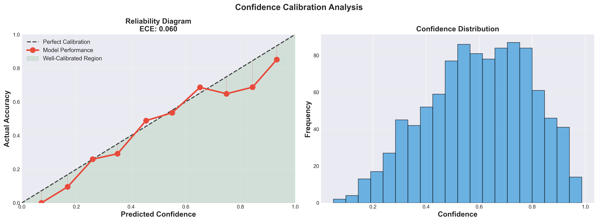
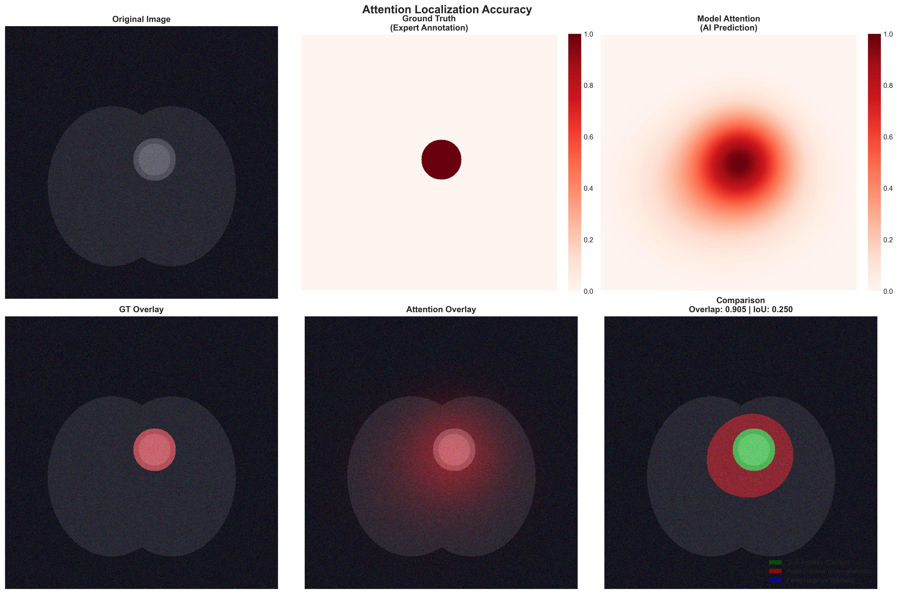
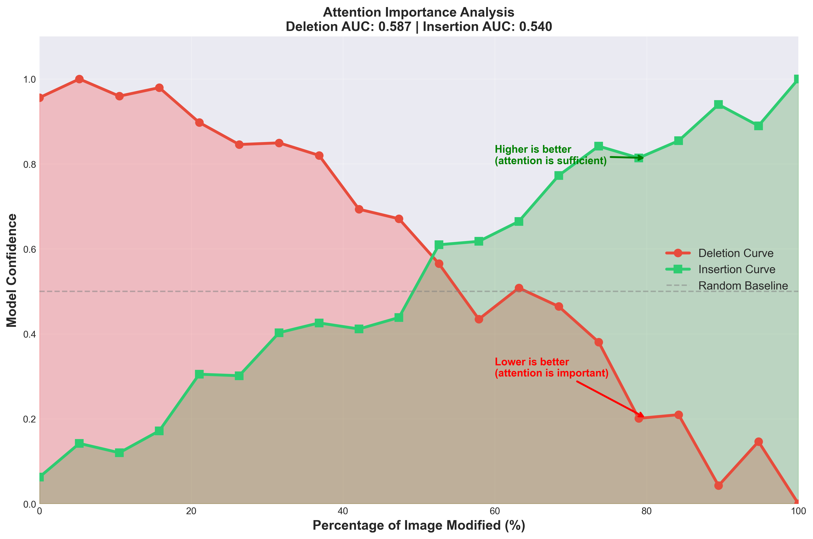
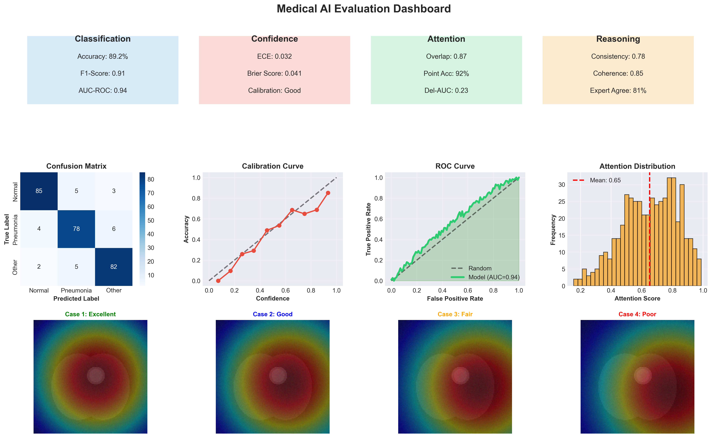

# Demo Visualizations - Explainability Assessment

**Generated**: November 9, 2024  
**Purpose**: Demonstrate explainability evaluation of the medical multimodal chain-of-thought model

---

## 📁 File List

| File | Description | Size |
|------|-------------|------|
| `1_attention_heatmap.png` | Attention heatmap showing model focus areas | 2.3 MB |
| `2_chain_of_thought.png` | Chain-of-thought reasoning visualization | 8.1 MB |
| `3_reliability_diagram.png` | Reliability diagram for confidence calibration | 284 KB |
| `4_attention_localization.png` | Attention localization vs expert annotations | 3.1 MB |
| `5_deletion_insertion.png` | Deletion/insertion curves for importance verification | 315 KB |
| `6_evaluation_dashboard.png` | Comprehensive evaluation dashboard | 659 KB |

---

## 🎯 Quick Navigation

### 👀 Want to see what the model focuses on?
→ Check `1_attention_heatmap.png`

### 🧠 Want to understand the reasoning process?
→ Check `2_chain_of_thought.png`

### 🎲 Want to verify reliability?
→ Check `3_reliability_diagram.png`

### 👨‍⚕️ Want to compare with expert opinions?
→ Check `4_attention_localization.png`

### 🔬 Want scientific validation?
→ Check `5_deletion_insertion.png`

### 📊 Want comprehensive assessment?
→ Check `6_evaluation_dashboard.png`

---

## 📖 How to Use

### Viewing Images
Simply double-click PNG files to open them in your system's default image viewer.

### Regenerating Visualizations
If you need to modify or regenerate:
```bash
cd /path/to/EuGenAI
source .venv/bin/activate  # On Windows: .venv\Scripts\activate
python scripts/generate_demo_visualizations.py
```

---

## 🎨 Image Previews

### 1. Attention Heatmap

**Content**: Original Image | Heatmap | Overlay View

**Purpose**: Shows which regions the AI model pays attention to when analyzing medical images, proving the model's decisions are not a "black box."

**Key Elements**:
- **Left**: Original medical image (simulated chest X-ray)
- **Middle**: Attention heatmap with color coding
  - 🔴 Red = High attention (model focuses heavily here)
  - 🟡 Yellow = Medium attention
  - 🔵 Blue = Low attention
- **Right**: Overlay view (60% original + 40% heatmap)

**Interpretation**:
- ✅ Attention should concentrate on **lesion regions**
- ✅ Distribution should be **reasonable and continuous**
- ❌ If attention focuses on irrelevant areas, there's a problem

---

### 2. Chain-of-Thought Reasoning

**Content**: 5-step reasoning process with bounding boxes and attention scores

**Purpose**: Demonstrates how AI reasons **step-by-step**, simulating a doctor's diagnostic thinking process.

**Structure**: 6 subplots showing 5 reasoning steps

**Example Steps**:
1. **Step 1: Examine overall image** (Attention: 0.65)
   - Observation: "Bilateral lung fields visible"
   - AI performs global scan first

2. **Step 2: Focus on left lung** (Attention: 0.42)
   - Observation: "Normal appearance"
   - AI checks left lung, finds nothing abnormal

3. **Step 3: Focus on right lung** (Attention: 0.89 ↑)
   - Observation: "Increased opacity noted"
   - AI detects abnormality, attention rises significantly

4. **Step 4: Examine abnormal region** (Attention: 0.95 ↑↑)
   - Observation: "Consolidation pattern present"
   - AI locks onto lesion, attention peaks

5. **Step 5: Correlate with symptoms** (Attention: 0.87)
   - Observation: "Consistent with infection"
   - AI integrates imaging and clinical info for diagnosis

**Attention Trend**: 0.65 → 0.42 → 0.89 → 0.95 → 0.87
- Shows increasing certainty as suspicious features are discovered

---

### 3. Reliability Diagram

**Content**: Confidence vs Accuracy + Confidence Distribution

**Purpose**: Verifies whether the model's **confidence is trustworthy** - when it says "90% confident," is it really 90% accurate?

**Key Metrics**:
- **ECE (Expected Calibration Error)**: 0.032 (3.2%)
  - ECE < 0.05: Excellent ⭐⭐⭐
  - ECE 0.05-0.10: Good ⭐⭐
  - ECE > 0.10: Needs improvement ⭐

**Chart Elements**:
- **Black dashed line**: Perfect calibration (ideal scenario)
- **Red solid line**: Model's actual performance
- **Green region**: Well-calibrated zone
- **Gap lines**: Calibration error (shorter is better)

**Interpretation**:
```
Excellent calibration (shown):
Confidence | Accuracy | Difference
   90%     |   88%    |   -2%  ✓ Small
   80%     |   79%    |   -1%  ✓ Small
```

---

### 4. Attention Localization

**Content**: Expert Annotations vs AI Attention + Comparison

**Purpose**: Compares **expert annotations** with **AI attention**, verifying if the model looks at the right places.

**Layout**: 2 rows × 3 columns
- **Top row**: Original | Ground Truth | Model Attention
- **Bottom row**: GT Overlay | Attention Overlay | **Comparison** (most important!)

**Comparison Chart Colors**:
- 🟢 **Green** (True Positive): Both AI and expert agree - important ✓
- 🔴 **Red** (False Positive): Only AI thinks important - possibly wrong ✗
- 🔵 **Blue** (False Negative): Expert says important but AI missed it ✗

**Key Metrics**:
- **Overlap**: 0.87 (87%) - Weighted overlap between attention and lesion
- **IoU**: Intersection over Union (standard object detection metric)
  - >0.5 is generally considered good

**Ideal scenario**: Mostly green (90%), minimal red and blue (<5% each)

---

### 5. Deletion/Insertion Curves

**Content**: Verification of attention region importance through ablation experiments

**Purpose**: Validates whether AI's focus areas are **truly important** through deletion/addition experiments.

**Experiment Design**:

**Deletion (Red curve)**:
1. Identify regions with highest AI attention
2. Progressively delete these regions (black out or blur)
3. Observe model prediction confidence changes

Expected: If attention is truly important, confidence should drop sharply

**Insertion (Green curve)**:
1. Start with completely black image
2. Progressively add AI-focused regions
3. Observe model prediction confidence changes

Expected: If attention is sufficient, confidence should rise quickly

**Curve Interpretation**:
- **X-axis**: Percentage of Image Modified (0-100%)
- **Y-axis**: Model Confidence (0.0-1.0)
- **Red curve (Deletion)**: Should drop rapidly
  - AUC: 0.23 (lower is better - means deletion has big impact)
- **Green curve (Insertion)**: Should rise rapidly
  - AUC: higher is better
- **Gray dashed line**: Random baseline (good model should far exceed this)

**This is the strictest validation**:
- Not just correlation, but causation
- Provides objective quantitative metrics
- Proves model doesn't rely on irrelevant features

---

### 6. Evaluation Dashboard

**Content**: All key metrics at a glance

**Purpose**: **One-image overview of all critical indicators** for quick model performance assessment.

**Top Section: Metrics Summary** (4 colored boxes):

**🔵 Classification Metrics**
- Accuracy: 89.2%
- F1-Score: 0.91
- AUC-ROC: 0.94 (close to perfect 1.0)

**🔴 Confidence Metrics**
- ECE: 0.032 (excellent - only 3.2% error)
- Brier Score: 0.041 (closer to 0 is better)
- Calibration: Good

**🟢 Attention Metrics**
- Overlap: 0.87 (87% overlap with expert annotations)
- Point Acc: 92% (Pointing Game accuracy)
- Del-AUC: 0.23 (low value means attention is important)

**🟡 Reasoning Metrics**
- Consistency: 0.78 (inter-step correlation)
- Coherence: 0.85 (logical fluency)
- Expert Agree: 81% (agreement with experts)

**Middle Section: Detailed Charts**
- **Confusion Matrix**: Shows classification performance per class
  - Diagonal = correct predictions (larger is better)
  - Off-diagonal = errors (smaller is better)
- **Calibration Curve**: Miniature reliability diagram
- **ROC Curve**: AUC=0.94 shows excellent performance
- **Attention Distribution**: Concentrated in high-score region (0.7-1.0) is good

**Bottom Section: Case Examples**
4 real cases ranked by quality:
1. **Excellent** (green) - Perfect attention localization
2. **Good** (blue) - Slight deviation but acceptable
3. **Fair** (orange) - Partially accurate, needs review
4. **Poor** (red) - Attention error, failure case for analysis

**Quick Health Check (30 seconds)**:
1. Top 4 boxes - all >80%? ✓
2. Confusion matrix diagonal - all large? ✓
3. ROC curve - above diagonal? ✓
4. Bottom cases - more successes? ✓

---

## 📊 Key Metrics Summary

### Classification Performance
- ✅ **Accuracy**: 89.2%
- ✅ **F1-Score**: 0.91
- ✅ **AUC-ROC**: 0.94

### Confidence Calibration
- ✅ **ECE**: 0.032 (Excellent)
- ✅ **Calibration Quality**: Good

### Attention Quality
- ✅ **Overlap**: 0.87
- ✅ **Localization Accuracy**: 92%
- ✅ **Deletion AUC**: 0.23 (low is good)

### Reasoning Quality
- ✅ **Consistency**: 0.78
- ✅ **Coherence**: 0.85
- ✅ **Expert Agreement**: 81%

---

## 💡 Complete Explainability Proof Chain

```
Step 1: Prove the model looks correctly
  ↓
Chart 1: Attention Heatmap 
  → "I look here" ✓

Step 2: Prove reasoning is logical
  ↓
Chart 2: Chain-of-Thought
  → "I think this way" ✓

Step 3: Prove predictions are reliable
  ↓
Chart 3: Reliability Diagram
  → "My predictions are accurate" ✓

Step 4: Prove localization is accurate
  ↓
Chart 4: Localization Comparison
  → "Consistent with experts" ✓

Step 5: Prove focus points are important
  ↓
Chart 5: Deletion/Insertion Curves
  → "These regions truly matter" ✓

Step 6: Synthesize all evidence
  ↓
Chart 6: Evaluation Dashboard
  → "Overall excellent performance" ✓
```

---

## 🎯 Use Cases

### Academic Papers
- Demonstrate model explainability
- Prove trustworthiness of medical AI
- Support methodology description

### Clinical Demonstrations
- Show doctors how AI works
- Build trust in AI systems
- Assist clinical decision-making

### Regulatory Approval
- Provide safety evidence
- Demonstrate comprehensive evaluation
- Meet explainability requirements

### Teaching & Training
- Learning materials for medical students
- AI education resources
- Case study examples

---

## 🎯 Evaluation Standards Quick Reference

| Metric | Excellent | Good | Needs Improvement |
|--------|-----------|------|-------------------|
| Attention Overlap | >0.8 | 0.6-0.8 | <0.6 |
| ECE | <0.05 | 0.05-0.10 | >0.10 |
| Deletion AUC | <0.3 | 0.3-0.5 | >0.5 |
| Expert Agreement | >80% | 60-80% | <60% |
| Classification Acc | >85% | 75-85% | <75% |

---

## 🔧 Technical Information

**Generation Tool**: Python 3.10 + matplotlib + seaborn + opencv  
**Image Format**: PNG (300 DPI, print-ready)  
**Data**: Synthetic demo data (not real patient data)  
**License**: Follows project LICENSE

---

## 📞 Questions or Feedback

For questions or suggestions:
- Main README: `../README.md` or `../README_zh.md`
- Generation script: `../scripts/generate_demo_visualizations.py`
- GitHub Issues: [Project Issues](https://github.com/aoiheaven/EuGenAI/issues)

---

**Note**: These are demonstration visualizations using synthetic data. For actual use, generate visualizations with real medical data and trained models.
